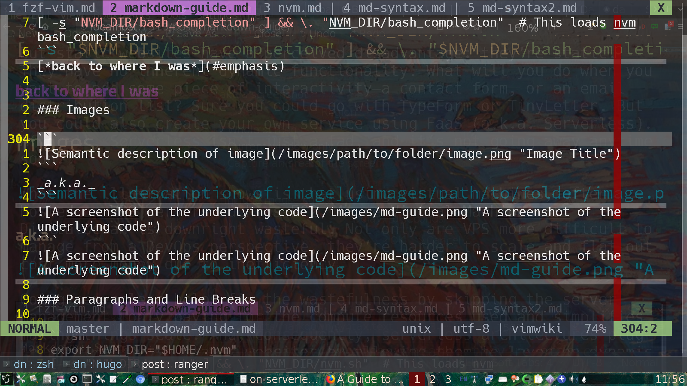

This page is intended to be viewed in a web-browser to fully experience the quality of `markdown`.

The practice of writing in *`markdown`* is widespread because it only requires `simple syntax` to create attractive slide presentations or a _blog-post_ for example. `Markdown` is intended to be as easy-to-read and as easy-to-write as is feasible. A markdown-formatted document is practically publishable as plain text, unlike it's HTML counterpart, raw in it's native _tagged_ surroundings. To illustrate some of the features, I put together this `tutorial` loosely based on the [original spec in 2004].  When you need to convert your document into `HTML` [pandoc](www.pandoc.org) is your swiss-army knife of converting into all kinds of formats, various wiki formats and epub to [self-publish](https://smartblogger.com/kindle-publishing/publish) for [Amazon Kindle](https://kdp.amazon.com/en_US/). You can [try writing some yourself]. Gone are the days when you had to learn `html` to publish a web-page!
<br>

<strong>Tip:</strong> `HTML` is awesome because of the ability to zoom in and out so easily with  `_Ctrl'n scroll'n_`. In case you didn't know, hold down `ctrl` and `=` or `-` to change font-sizes. It will will neatly adjust itself to the screen. Alternatively, hold down the `ctrl` key and scroll your mousewheel.

  [original spec in 2004]: https://daringfireball.net/projects/markdown/syntax.text
  [try writing some yourself]: https://markdown-it.github.io/
----
Markdown's syntax has been influenced by several existing text-to-HTML filters such as
-- [Setext](http://docutils.sourceforge.net/mirror/setext.html), [atx](http://www.aaronsw.com/2002/atx/), [Textile](http://textism.com/tools/textile/), [reStructuredText](http://docutils.sourceforge.net/rst.html),
[Grutatext](http://www.triptico.com/software/grutatxt.html), and [EtText](http://ettext.taint.org/doc/) -- the single biggest source of inspiration for Markdown's syntax is the format of plain text email.

For code blocks, I will surround the markdown with three back-ticks (```) above and below the specified lines as typed into a text editor. Following that, is what's served up by a web browser such as Firefox, Opera, Safari or Chrome. It goes like this:__

<br>

__Type:__
<br>

```md
Largest Font
============
```
**to produce**

Largest Font
============

**similarly, type**

```md
Elements
--------
```
**or either**

```md
## Elements
```
**to produce**

Elements
--------

__type__

```md
### Links
```
**to produce**

### Links

_...and so on down the line._

<br>
`######` produces the smallest header __*a.k.a. H6*__

<br>
A links' text is delimited by [square brackets] immediately followed by parentheses enclosing the URL that the link points to.

```md
This is an [example](http://example.com/) of an inline link.
```
**will produce**

<br>
This is an [example](http://example.com/) of an inline link.

<br>
To create a link to a different location on the same page, you refer to an embedded link in the markdown _this way:_

<br>
__type__


```md
**take me to the** [Coloured Code](#coloured_code)
```

**take me to the** [Coloured Code](#coloured_code)

<br>
**below this is the `html` code** that the `Coloured Code` link leads to. Most `HTML` is _obscured_ from the reader, and the same goes for the `markdown` that this page is written in. No doubt, it is up to the author to add `HTML`, `javascript` or `go` code plugins for added functionality.

```html
<h3 id="coloured_code">Coloured Code</h3>
<!---`hidden comment`: I like the old spelling (`shrugs`)--->
```

<h3 id="emphasis">Emphasis</h3>

Markdown treats asterisks (`*`) and underscores (`_`) as indicators of
emphasis. Text wrapped with one `*` or `_` will be wrapped with an
HTML `<em>` tag; double `*`'s or `_`'s will be wrapped with an HTML
`<strong>` tag. E.g., this input:

```md
*single asterisks*
```
**becomes**
*single asterisks*

```md
_single underscores_
```
**becomes**
_single underscores_

```md
**double asterisks**
```
**becomes**
**double asterisks**

```md
__double underscores__
```
**becomes**
__double underscores__

### Lists

Markdown supports ordered (numbered) and unordered (bulleted) lists.

Unordered lists can use asterisks or pluses or hyphens _interchangably_ as list markers when followed by a space:

```md
*   Red
+   Green
-   Blue
```

**produces:**

-   Red
*   Green
+   Blue

Ordered lists use numbers followed by periods followed by a space and the list item. The actual numbers you use to mark the list have no effect on the HTML output. You could even jumble up the numbers and it would still produce an ordered list:

```md
2.  Apples
1.  Peaches
44.  Cherries
```
**produces:**

2.  Apples
1.  Peaches
44.  Cherries


As for bulleted lists, paragraphs can be wrapped with hanging indents, but they don't have to be. List items may consist of multiple paragraphs. If subsequent paragraphs in a list item are indented by either 4 spaces (or one tab) they will be included in the bulleted paragraph:

```md
*   Lorem ipsum dolor sit amet, consectetuer adipiscing elit.
    Aliquam hendrerit mi posuere lectus. Vestibulum enim wisi,
    viverra nec, fringilla in, laoreet vitae, risus.
* If you never have written a single line in markdown markup, don't worry,
it's easy to learn. You'll probably be surprised
how handy it is once you get used to it.

    You might miss it whenever the tech you're using
doesn't support it.
* Another item on the list
```

*   Lorem ipsum dolor sit amet, consectetuer adipiscing elit.
    Aliquam hendrerit mi posuere lectus. Vestibulum enim wisi,
    viverra nec, fringilla in, laoreet vitae, risus.
* If you never have written a single line in markdown markup, don't worry,
it's easy to learn. You'll probably be surprised
how handy it is once you get used to it.

    You might miss it whenever the tech you're using
doesn't support it.
* Another item on the list

To put a blockquote within a list item, the blockquote's **>**
delimiters need to be indented:

```md
*   A list item with a blockquote:

    > This is a blockquote
inside a list item.
It's seperated from the next item by the next blank line.
* The last item on the list
```
**produces:**

*   A list item with a blockquote:

    > This is a blockquote
inside a list item.
It's seperated from the next item by the next blank line.
* The last item on the list


### Inline Code

To highlight a single code command surrounded by ordinary text, wrap it with backtick quotes (`` ` ``). Unlike a pre-formatted code block, a code span indicates code within a normal paragraph. It will be shown in the 'mono' font of the terminal:

```
Use the `printf()` function.
```
**produces:**

<br>
Use the `printf()` function.

### Code Blocks

Pre-formatted code blocks are used for writing about programming or
markup source code. Rather than forming normal paragraphs, the lines
of a code block are interpreted literally. Markdown wraps a code block
in both `<pre>` and `<code>` tags.

To produce a code block in Markdown, simply indent every line of the
block by at least 4 spaces or 1 tab.

```md
This is a normal paragraph:

    This is a code block.
    When each line of code is indented by 4 spaces
    the block will be highlighted and rendered
    as a block of machine code.
```
**shows up as**

<br>

This is a normal paragraph:

    This is a code block.
    When each line of code is indented by 4 spaces
    the block will be highlighted and rendered
    as a block of machine code.


A code block continues until it reaches a line that is not indented
(or the end of the article).

<br>
To put a code block in a list, the code block needs to be indented *twice* -- 8 spaces or two tabs:

```md
*   This list contains code:

        this is code
        originally indented by 8 spaces
```
**produces:**

*   This list contains code:

        this is code
        originally indented by 8 spaces

Within a code block, ampersands (`&`) and angle brackets (`<` and `>`)
are automatically converted into HTML entities. This makes it very
easy to include example HTML source code using Markdown -- just paste
it and indent it, and Markdown will handle the hassle of encoding the
ampersands and angle brackets in `HTML`.

```
    <div class="footer">
        &copy; 2004 Foo Corporation
    </div>
```

**produces this:**

    <div class="footer">
        &copy; 2004 Foo Corporation
    </div>

Regular Markdown syntax is not processed within code blocks. E.g., asterisks are just literal asterisks within a code block. This means it's also easy to use Markdown to write about Markdown's own syntax.

<br>

<h3 id="coloured_code">Coloured Code</h3>
<!--- hidden comment... I just like it spelled the old way --->

Nowadays there is support for code highlighting for about 160 programming languages. This is a snippet written in [bash](https://en.wikipedia.org/wiki/Bash_(Unix_shell)), the commandline language of the Linux shell. In addition to the three backticks you can add an abbreiviation such as `md` (for markdown)or `sh` (for the bash shell).


```sh
export NVM_DIR="$HOME/.nvm"
[ -s "$NVM_DIR/nvm.sh" ] && \. "$NVM_DIR/nvm.sh"  # This loads nvm
[ -s "$NVM_DIR/bash_completion" ] && \. "$NVM_DIR/bash_completion"  # This loads nvm bash_completion
```
[**back to earlier position in document**](#emphasis)

### Images

To insert images to your markdown file, use the markup ``. The path can either be relative to the website, or a full URL for an external image. _Below_ is an screenshot of my desktop (I use semi-transparent backgrounds in most programs I use, incuding __Neovim__ my text editor. [Hugo's embedded server](https://gohugo.io/commands/hugo_server/) renders the changes just as soon as I save them and I see the results in the layer below the layer I'm currently working in:

```md

```
__a.k.a.__
```md

```


### Video

There are a couple of ways to share a video. Locally stored videos within HTML5 `<video>` tags and within `<iframe>` tags for externally hosted videos .
Plain markdown results in a link to the video, however with raw `HTML` we get the behaviour we're more accustomed to.

**this:**
```md
[](https://www.youtube.com/embed/aVHsUCALkoU)
```
**produces:**

[](https://www.youtube.com/embed/aVHsUCALkoU)

**this snippet will embed the video onto the page:**

```html
<iframe width="420" height="315" src="https://www.youtube.com/embed/aVHsUCALkoU" frameborder="0" allowfullscreen></iframe>
```
**produces this embedded video of the author making _fruit leather_ with a homemade _solar dehydrator_.:**

<br>
<iframe width="420" height="315" src="https://www.youtube.com/embed/aVHsUCALkoU" frameborder="0" allowfullscreen></iframe>

### Paragraphs and Line Breaks

A paragraph is simply one or more consecutive lines of text, separated by one or more blank lines. Normal paragraphs should not be indented with spaces or tabs.

If you want to be sure of getting empty lines between elements, insert a `<br />` _break tag_ to be certain of making blank lines.

### Tables

``` {.md}
| Left align   | Center align  | Right align    |
| :----------- | :-----------: | -------------: |
| This         | This          | This           |
| column       | column        | column         |
| will         | will          | will           |
| be bold &    | be            | be             |
| left-        | center-       | right-         |
| aligned      | aligned       | aligned        |
```

| Left align   | Center align  | Right align    |
| :----------- | :-----------: | -------------: |
| This         | This          | This           |
| column       | column        | column         |
| will         | will          | will           |
| be bold &    | be            | be             |
| left-        | center-       | right-         |
| aligned      | aligned       | aligned        |

### Blockquotes

Markdown uses email-style `>` characters for blockquoting. Blockquotes can contain other Markdown elements, including headers, lists, and code blocks. Put `>` before the first line of a _hard-wrapped_ paragraph:

```md
> Sorrow prepares you for joy. It violently sweeps everything out of your house,
so that new joy can find space to enter.
It shakes the yellow leaves from the bough of your heart, so that fresh,
green leaves can grow in their place. It pulls up the rotten roots,
so that new roots hidden beneath have room to grow.
Whatever sorrow shakes from your heart, far better things will take their place.
― Rumi
```

> Sorrow prepares you for joy. It violently sweeps everything out of your house,
so that new joy can find space to enter.
It shakes the yellow leaves from the bough of your heart, so that fresh,
green leaves can grow in their place. It pulls up the rotten roots,
so that new roots hidden beneath have room to grow.
Whatever sorrow shakes from your heart, far better things will take their place.
― Rumi

